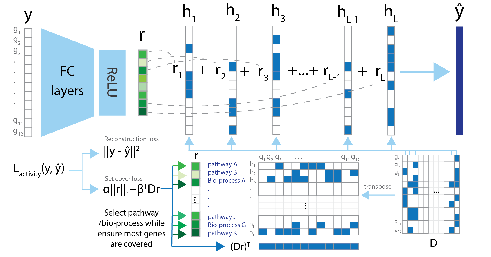
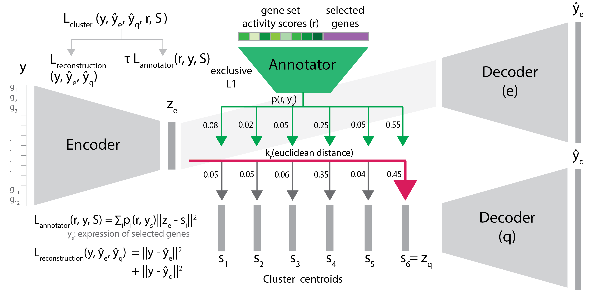

# Introduction
UNIFAN (**Un**supervised S**i**ngle-cell **F**unctional **An**notation) simultaneously clusters and annotates cells with known biological processes (including pathways). For each single cell, UNIFAN first infers gene set activity scores (denoted by r in the figure below) associated with this cell using the input gene sets. 



Next, UNIFAN clusters cells by using the learned gene set activity scores (r) and a reduced dimension representation of the expression of genes in the cell. The gene set activity scores are used by an “annotator” to guide the clustering such that cells sharing similar biological processes are more likely to be grouped together. Such design allows the method to focus on the key processes when clustering cells and so can overcome issues related to noise and dropout while simultaneously selecting marker gene sets which can be used to annotate clusters. To allow the selection of marker genes for each cluster, we also added a subset of the most variable genes selected using Seuratv3 (Stuart et al., [2019](https://doi.org/10.1016/j.cell.2019.05.031)) as features for the annotator. 



## Table of Contents
- [Get started](#Get-started)
- [Command-line tools](#Command-line)
- [Tutorials](#Tutorials)
- [Credits](#Credits)

# Get-started 
## Prerequisites 
* Python >= 3.6
* Python side-packages:   
-- pytorch >= 1.9.0  
-- numpy >= 1.19.2     
-- pandas>=1.1.5   
-- scanpy >= 1.7.2  
-- tqdm >= 4.61.1  
-- scikit-learn>=0.24.2  
-- umap-learn>=0.5.1  
-- matplotlib >= 3.3.4   
-- seaborn >= 0.11.0   

## Installation 

### Install within a virtual environment 

It is recommended to use a virtural environment/pacakges manager such as [Anaconda](https://www.anaconda.com/). After successfully installing Anaconda/Miniconda, create an environment by the following: 

```shell
conda create -n myenv python=3.6
```

You can then install and run the package in the virtual environment. Activate the virtural environment by: 

```shell
conda activate myenv
```

Make sure you have **pip** installed in your environment. You may check by 

```shell
conda list
```

If not installed, then: 

```shell
conda install pip
```
### Install Pytorch

UNIFAN is built based on Pytorch and supporting both CPU or GPU. Make sure you have Pytorch (>= 1.9.0) installed in your virtual environment. If not, please visist [Pytorch](https://pytorch.org/) and install the appropriate version.  

### Install UNIFAN

Install by: 

```shell
pip install git+https://github.com/doraadong/UNIFAN.git
```

If you want to upgrade UNIFAN to the latest version, then first uninstall it by:

```shell
pip uninstall unifan
```

And then just run the pip install command again. 

# Command-line 

You may import UNIFAN as an package and use it in your code (See [Tutorials](#Tutorials) for details). Or you may train models using the following command-line tool. 

## Run UNIFAN

Run UNIFAN by (arguments are taken for example): 

```shell
main.py -i ../example/input/Limb_Muscle.h5ad -o ../example/output -p tabula_muris -t Limb_Muscle -l cell_ontology_class
```
The usage of this command is listed as follows. Note only the first 4 inputs are required:

```shell
usage: main.py [-h] -i INPUT -o OUTPUT -p PROJECT -t TISSUE [-l LABEL]
               [-v VARIABLE] [-r PRIOR] [-f {gene_sets,gene,gene_gene_sets}]
               [-a ALPHA] [-b BETA] [-g GAMMA] [-u TAU] [-d DIM] [-s BATCH]
               [-na NANNO] [-ns NSCORE] [-nu NAUTO] [-nc NCLUSTER]
               [-nze NZENCO] [-nzd NZDECO] [-dze DIMZENCO] [-dzd DIMZDECO]
               [-nre NRENCO] [-dre DIMRENCO] [-drd DIMRDECO]
               [-n {sigmoid,non-negative,gaussian}] [-m RANDOM] [-c CUDA]
               [-w NWORKERS]

optional arguments:
  -h, --help            show this help message and exit
  -i INPUT, --input INPUT
                        string, path to the input expression data, default
                        '../input/data.h5ad'
  -o OUTPUT, --output OUTPUT
                        string, path to the output folder, default
                        '../output/'
  -p PROJECT, --project PROJECT
                        string, identifier for the project, e.g., tabula_muris
  -t TISSUE, --tissue TISSUE
                        string, tissue where the input data is sampled from
  -l LABEL, --label LABEL
                        string, optional, the column / field name of the
                        ground truth label, if available; used for evaluation
                        only; default None
  -v VARIABLE, --variable VARIABLE
                        string, optional, the column / field name of the
                        highly variable genes; default 'highly_variable'
  -r PRIOR, --prior PRIOR
                        string, optional, gene set file names used to learn
                        the gene set activity scores, use '+' to separate
                        multiple gene set names, default
                        c5.go.bp.v7.4.symbols.gmt+c2.cp.v7.4.symbols.gmt+TF-
                        DNA
  -f {gene_sets,gene,gene_gene_sets}, --features {gene_sets,gene,gene_gene_sets}
                        string, optional, features used for the annotator, any
                        of 'gene_sets', 'gene' or 'gene_gene_sets', default
                        'gene_gene_sets'
  -a ALPHA, --alpha ALPHA
                        float, optional, hyperparameter for the L1 term in the
                        set cover loss, default 1e-2
  -b BETA, --beta BETA  float, optional, hyperparameter for the set cover term
                        in the set cover loss, default 1e-5
  -g GAMMA, --gamma GAMMA
                        float, optional, hyperparameter for the exclusive L1
                        term, default 1e-3
  -u TAU, --tau TAU     float, optional, hyperparameter for the annotator
                        loss, default 10
  -d DIM, --dim DIM     integer, optional, dimension for the low-dimensional
                        representation, default 32
  -s BATCH, --batch BATCH
                        integer, optional, batch size for training except for
                        pretraining annotator (fixed at 32), default 128
  -na NANNO, --nanno NANNO
                        integer, optional, number of epochs to pretrain the
                        annotator, default 50
  -ns NSCORE, --nscore NSCORE
                        integer, optional, number of epochs to train the gene
                        set activity model, default 70
  -nu NAUTO, --nauto NAUTO
                        integer, optional, number of epochs to pretrain the
                        annocluster model, default 50
  -nc NCLUSTER, --ncluster NCLUSTER
                        integer, optional, number of epochs to train the
                        annocluster model, default 25
  -nze NZENCO, --nzenco NZENCO
                        float, optional, number of hidden layers for encoder
                        of annocluster, default 3
  -nzd NZDECO, --nzdeco NZDECO
                        float, optional, number of hidden layers for decoder
                        of annocluster, default 2
  -dze DIMZENCO, --dimzenco DIMZENCO
                        integer, optional, number of nodes for hidden layers
                        for encoder of annocluster, default 128
  -dzd DIMZDECO, --dimzdeco DIMZDECO
                        integer, optional, number of nodes for hidden layers
                        for decoder of annocluster, default 128
  -nre NRENCO, --nrenco NRENCO
                        integer, optional, number of hidden layers for the
                        encoder of gene set activity scores model, default 5
  -dre DIMRENCO, --dimrenco DIMRENCO
                        integer, optional, number of nodes for hidden layers
                        for encoder of gene set activity scores model, default
                        128
  -drd DIMRDECO, --dimrdeco DIMRDECO
                        integer, optional, number of nodes for hidden layers
                        for decoder of gene set activity scores model, default
                        128
  -n {sigmoid,non-negative,gaussian}, --network {sigmoid,non-negative,gaussian}
                        string, optional, the encoder for the gene set
                        activity model, any of 'sigmoid', 'non-negative' or
                        'gaussian', default 'non-negative'
  -m SEED, --seed SEED
                        integer, optional, random seed for the initialization,
                        default 0
  -c CUDA, --cuda CUDA  boolean, optional, if use GPU for neural network
                        training, default False
  -w NWORKERS, --nworkers NWORKERS
                        integer, optional, number of works for dataloader,
                        default 8
```


# Tutorials

Github rendering disables some functionalities of Jupyter notebooks. We recommend using [nbviewer](https://nbviewer.jupyter.org/) to view the following tutorials. 

## Run UNIFAN on example data  


### Get the example input data 

# Credits
The software is an implementation of the method UNIFAN, jointly developed by [Dora Li](https://github.com/doraadong), [Jun Ding](https://github.com/phoenixding) and Ziv Bar-Joseph from [System Biology Group @ Carnegie Mellon University](http://sb.cs.cmu.edu/). 

# Contacts
* dongshul at andrew.cmu.edu 

# License 
This project is licensed under the MIT License - see the [LICENSE](LICENSE) file for details


